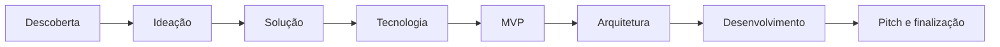

# Ideathon Web3 — da ideia ao MVP

Metodologia educacional aplicada ao Curso Técnico em Informática da **Escola Estadual Geraldo Jardim Linhares**, em Belo Horizonte, para transformar problemas reais em projetos digitais demonstráveis.

O percurso organiza o desenvolvimento em **oito etapas**, integra diferentes componentes curriculares e utiliza o GitHub como espaço de documentação, colaboração e avaliação por evidências.

> **8 etapas para transformar ideias em projetos na Web3:** descoberta, ideação, solução, tecnologia, MVP, arquitetura, desenvolvimento e pitch.

## Visão do projeto

O Ideathon parte de problemas da escola ou da comunidade e conduz as equipes até a construção de um MVP. A tecnologia não é escolhida antecipadamente: cada equipe precisa demonstrar que sua arquitetura e, quando aplicável, o uso de Web3 respondem a requisitos reais.

A proposta articula:

- trabalho em equipe;
- investigação orientada ao usuário;
- programação e banco de dados;
- design de interfaces e experiência do usuário;
- arquitetura e engenharia de software;
- Git e GitHub;
- Inteligência Artificial como ferramenta de apoio;
- Web3 com foco em verificabilidade, transparência e uso responsável.

## Metodologia em 8 etapas

| Etapa | Foco | Pergunta central | Entregável |
|---|---|---|---|
| **01 — Descoberta** | Entender o problema | Quem enfrenta a dor e por que ela importa? | Problema claro e público definido |
| **02 — Ideação** | Gerar e escolher ideias | Qual hipótese oferece maior valor e viabilidade? | Ideia escolhida e proposta de valor |
| **03 — Solução** | Desenhar a experiência | Como o usuário percorre a solução? | Fluxo do usuário e esboço da solução |
| **04 — Tecnologia** | Definir recursos | Quais tecnologias são necessárias e por quê? | Stack, integrações e requisitos definidos |
| **05 — MVP** | Delimitar o mínimo viável | Qual é o menor produto capaz de demonstrar valor? | MVP priorizado e critérios de sucesso |
| **06 — Arquitetura** | Planejar a construção | Como os componentes, dados e tarefas se organizam? | Arquitetura e plano de execução |
| **07 — Desenvolvimento** | Construir e testar | O fluxo principal funciona de ponta a ponta? | MVP executável e evidências de teste |
| **08 — Pitch e finalização** | Demonstrar resultados | O problema, a solução e os aprendizados estão claros? | Pitch, demonstração e próximos passos |

A descrição completa, com atividades, critérios de conclusão, estrutura de pastas, rubrica e diretrizes de segurança, está em **[METODOLOGIA.md](METODOLOGIA.md)**.



## Princípios pedagógicos

### Aprender construindo

Os conteúdos técnicos são mobilizados durante a solução de um problema concreto. A equipe precisa investigar, decidir, implementar, testar e explicar o que construiu.

### Avaliar por evidências

A avaliação considera artefatos verificáveis no repositório: documentos, fluxos, protótipos, issues, commits, arquitetura, código, testes e apresentação.

### Manter tudo no GitHub

O GitHub funciona como portfólio e memória do processo. Cada etapa deve produzir um entregável versionado, permitindo acompanhar a evolução do projeto e a contribuição da equipe.

### Focar no MVP

O objetivo não é construir uma plataforma completa durante o Ideathon. A equipe deve entregar o menor fluxo funcional capaz de demonstrar sua proposta de valor.

### Usar Web3 somente quando necessário

Blockchain deve resolver um requisito concreto, como registro auditável, verificabilidade, interoperabilidade, identidade ou coordenação entre partes. Quando um banco de dados convencional for suficiente, a decisão técnica deve reconhecer isso.

## Organização sugerida

- **Duração:** 8 dias ou 8 encontros.
- **Participantes:** estudantes organizados em equipes pequenas.
- **Mentoria:** checkpoints diários com revisão de escopo e entregáveis.
- **Repositório:** um repositório por equipe ou diretórios separados por projeto.
- **Culminância:** demonstração do MVP e pitch técnico.

## Integração curricular

| Área | Aplicação no Ideathon |
|---|---|
| Programação Web | lógica, frontend, backend, APIs e validação |
| Banco de Dados | modelagem, persistência, integridade e consultas |
| Laboratório Web | integração de componentes e implantação |
| Laboratório de Software | requisitos, arquitetura, versionamento e testes |
| Design | pesquisa, wireframes, UI/UX e comunicação visual |
| Redes e Segurança | arquitetura, autenticação, proteção de dados e configuração |
| Web3 | carteiras de teste, contratos, registros verificáveis e análise de necessidade |

## Tecnologias de apoio

As equipes podem utilizar, conforme os requisitos do projeto:

- GitHub para código, documentação, issues e colaboração;
- GPT, Gemini e GitHub Copilot como assistentes de pesquisa e desenvolvimento;
- bancos de dados relacionais ou não relacionais;
- ferramentas de prototipagem;
- APIs e serviços de nuvem;
- ambientes Web3 de teste, sem ativos de valor econômico.

Todo conteúdo gerado por IA deve ser revisado, compreendido e testado pela equipe. Credenciais, dados pessoais e informações sensíveis não devem ser enviados a ferramentas externas nem versionados no repositório.

## Portfólio de problemas trabalhados

A aplicação inicial da metodologia produziu propostas relacionadas a desafios educacionais e comunitários, incluindo:

- acesso a serviços e informações comunitárias;
- valorização de artistas independentes;
- registros verificáveis de atividades acadêmicas;
- inclusão digital de pequenos comerciantes;
- gestão transparente de competições escolares;
- flexibilidade de trajetórias de aprendizagem;
- organização e acesso ao acervo da biblioteca escolar.

Esses projetos representam contextos de aprendizagem. Cada implementação deve documentar claramente seu estágio, limitações, tecnologias efetivamente utilizadas e partes ainda simuladas.

## Estrutura recomendada para as equipes

```text
.
├── README.md
├── docs/
│   ├── 01-descoberta.md
│   ├── 02-ideacao.md
│   ├── 03-solucao.md
│   ├── 04-tecnologia.md
│   ├── 05-mvp.md
│   ├── 06-arquitetura.md
│   ├── 07-testes.md
│   └── 08-pitch.md
├── src/
├── tests/
├── assets/
└── .github/
    ├── ISSUE_TEMPLATE/
    └── pull_request_template.md
```

## Critérios de avaliação

A avaliação considera oito dimensões:

1. compreensão do problema e do usuário;
2. qualidade da proposta de valor;
3. coerência do fluxo e da experiência;
4. fundamentação das decisões técnicas;
5. definição e controle do escopo do MVP;
6. arquitetura, organização e colaboração;
7. implementação, testes e documentação;
8. demonstração, pitch e reflexão final.

A rubrica detalhada está em **[METODOLOGIA.md](METODOLOGIA.md#avaliação-por-evidências)**.

## Segurança, privacidade e ética

- Não publicar notas, dados pessoais ou informações identificáveis de estudantes.
- Não armazenar dados sensíveis em blockchain.
- Não versionar chaves privadas, tokens, senhas ou arquivos `.env`.
- Utilizar testnets, devnets e ativos sem valor econômico.
- Explicar limitações e simulações de forma transparente.
- Evitar incentivos financeiros ou práticas especulativas em atividades escolares.
- Coletar somente os dados necessários para o funcionamento do protótipo.

## Resultado esperado

Ao final do Ideathon, cada equipe deve possuir:

- problema e público claramente definidos;
- proposta de valor documentada;
- fluxo do usuário e protótipo;
- stack e arquitetura justificadas;
- escopo de MVP controlado;
- repositório organizado e histórico de colaboração;
- MVP demonstrável;
- testes e limitações registrados;
- pitch e plano de continuidade.

---

**Responsável pela prática pedagógica:** Sandra Maria Pereira  
**Instituição:** Escola Estadual Geraldo Jardim Linhares  
**Curso:** Técnico em Informática